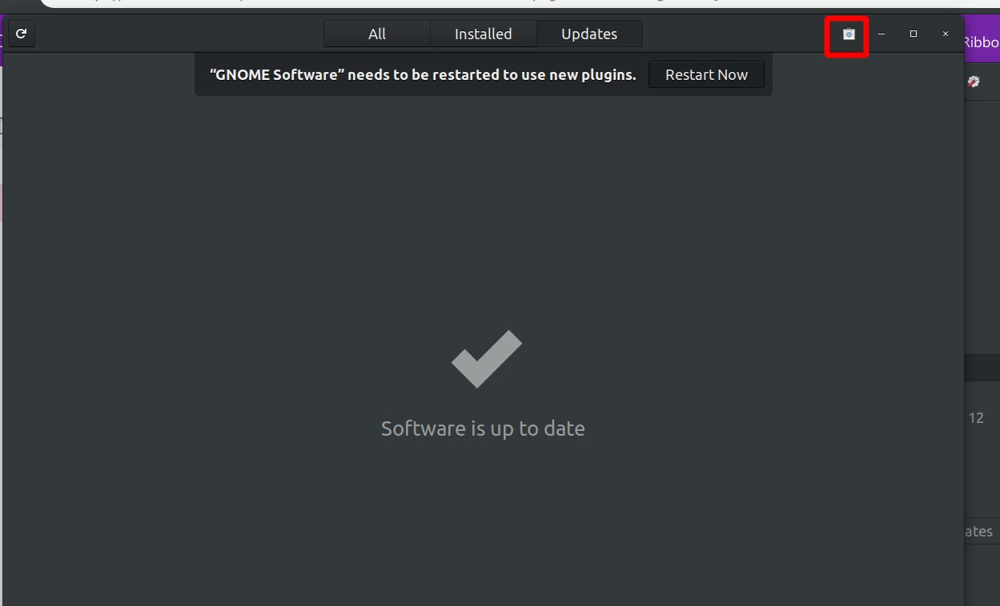
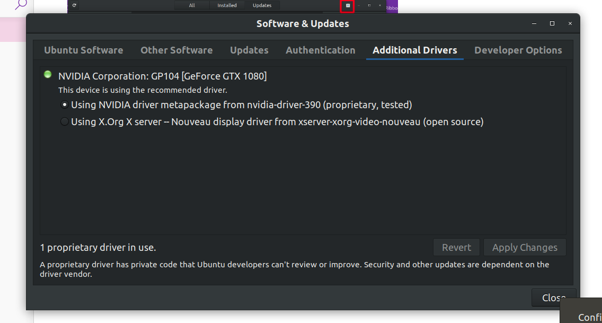
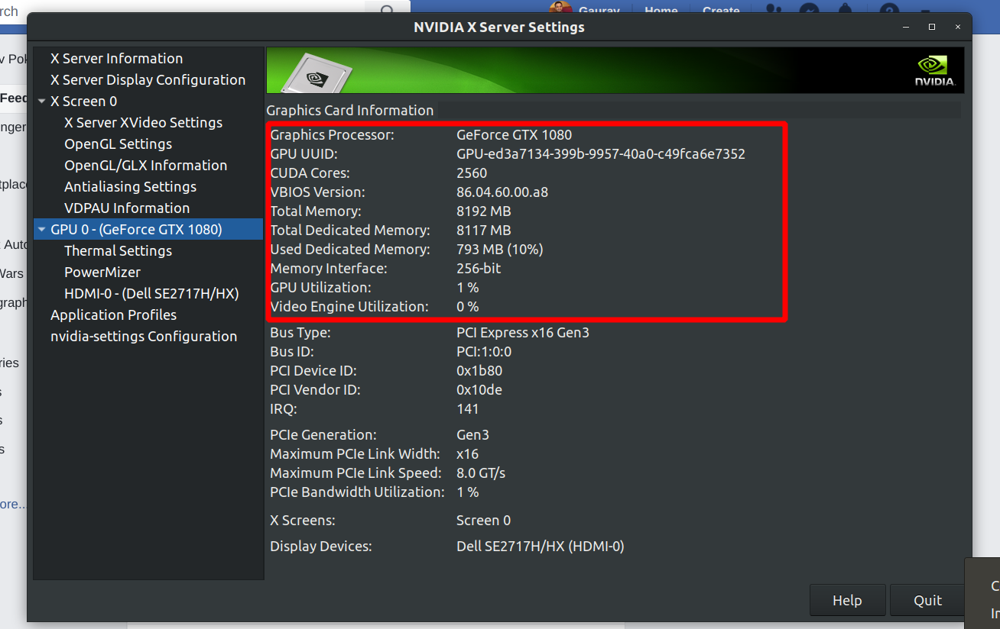

# Ubuntu install Nvidia GPU driver 
Go to Settings -> Details -> Check for updates 


Software and updates 

Additional drivers 

Using Nvidia driver apply changes they will ask you to set up a password use `123456789` click on next 



Go to terminal type `reboot` 

Restart the system when you restart pay attention there will be something related to MOK press enter in 6 seconds 

Hit enter or whatever key they tell before that countdown ends 

Then select 2nd option something related to `Enroll Key` read this link for it 

They will ask you to enter password use the one you set above `123456789` 

If any time they ask any thing keep selecting hat enroll key options the wordings won't match exactly but somewhat similar to it you will understand 

[How can I install Nvidia drivers on Ubuntu 18.04 with secure boot?](https://askubuntu.com/questions/1048135/how-can-i-install-nvidia-drivers-on-ubuntu-18-04-with-secure-boot)

```
I opened "Software & Updates" and clicked the "Additional Drivers" tab, I then chose the recommended driver and clicked "Apply Changes", while the driver was installing somewhere in the middle it prompted me for secure boot password, that it when I entered the password I set up when I was installing Ubuntu, after it finished applying I restarted my device, when it was rebooting a blue menu appeared asking to press any key, I pressed then a menu labeled as "Perform MOK Management" appeared, there were the following four options:

1. Continue boot
2. Enroll Key
3. Enroll Key from Disk
4. Enroll Key from Hash
```
If everything goes correctly when you reboot  

Under NVIDIA server setting you can see this 


### If you are not able to reboot or if the system hangs 
Restart PC and select Advanced Ubuntu option -> start ubuntu in Secure mode -> select normal boot option 

Open terminal in the secure mode and follow these steps 

[Ubuntu will not boot normally after nvidia driver install](https://askubuntu.com/questions/955589/ubuntu-will-not-boot-normally-after-nvidia-driver-install)

```
sudo apt-get purge nvidia* 
Reboot 
```

## CUDA TOOLKIT 
### Installation
[Package Manager Installation](https://docs.nvidia.com/cuda/cuda-installation-guide-linux/#package-manager-installation)

[CUDA Toolkit 10.2 Download](https://developer.nvidia.com/cuda-downloads)

### Uninstall
[To remove CUDA Toolkit:](https://docs.nvidia.com/cuda/cuda-installation-guide-linux/index.html#verify-you-have-cuda-enabled-system)

`sudo apt-get --purge remove "*cublas*" "cuda*"` 

To remove NVIDIA Drivers: 

`sudo apt-get --purge remove "*nvidia*"`

## NVIDIA System Management Interface
`nvidia-smi`